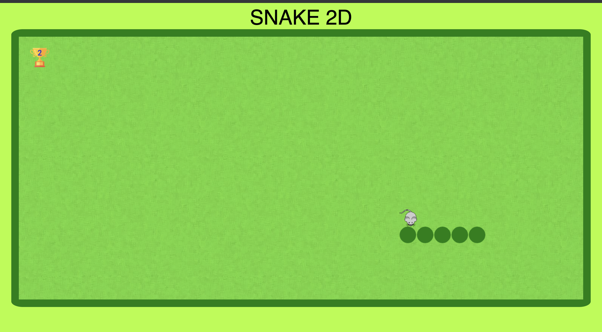
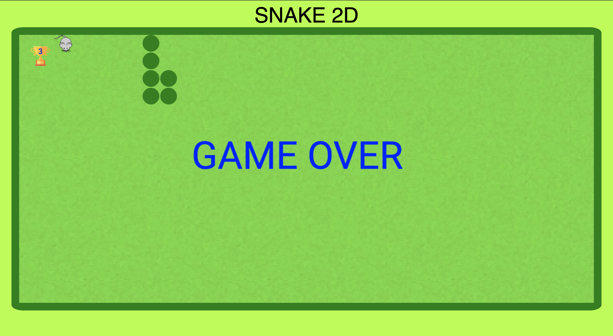

# Snake-2D(OOPs)
Tech Stack: HTML, CSS, JS

 
Everything is done on the canvas area of the document. 

To create a rectangle: 
To create an arc/circle:

this: To access an attribute of a function within the class itself.
Game loop comprises of draw function and update function.
Snake class is created inside the init function and called only once. 
In the snake class, a method is created to create the body of the snake and also add it's properties. After that the snake is only updated(erased from back and drawn at the front of the snake).
setInterval(fun,time) function is used in order to call a function again and again after every specified time interval.(*time is in milliseconds*)

Done with adding board to the screen and creation of body of the snake.
We are not actually creating the entire body of snake again and again but just popping up the array from back(in the way pair of x,y coordinates are added).
Snake is just an array named "cells".   While we try to move the snake, the things done to give people an illusion that the snake is moving are:
<ul>
<li> popping up from back of the snake. cells.pop();</li>
<li> adding a square at the beginning of the snake. cells.unshift({x,y});</li>
</ul>

addEventListener to used to apply action on the document.
<ul><li>document.addEventListener('click',function);  'keydown' can also be used instead of 'click'. It would react to any key pressed on the keyboard.
</li></ul>
e.g function f(e){ console.log("ajjoo the key pressed is ",e.key); }

Whenever a key is pressed, the head of snake is added in a direction accordingly.
e.g if(e.key == "ArrowLeft") headx-=1;

food is randomly generated.
Length of snake increases as soon as head of the snake reaches the food.(The end of snake is not popped when head.x==food.x && head.y==food.y)
We can keep a global variable "score" for calculationg the amount of food eaten by snake. score+=1 when  headx==food.x && heady==food.y.

Make Sure: -
<ul><li>Food doesn't generate on the snake itself.</li>
  <li>Game is over as soon as the snake touches any end of the canvas.(e.g clearInterval(f))</li>
</ul>
